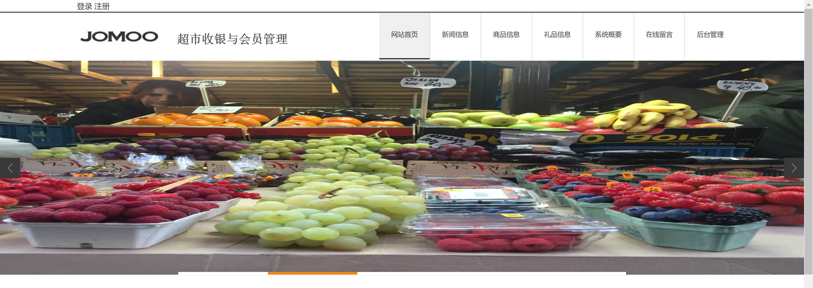
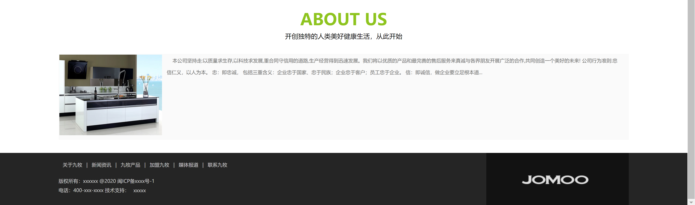
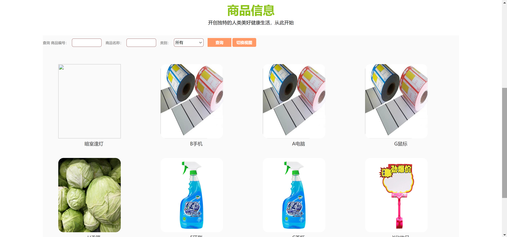
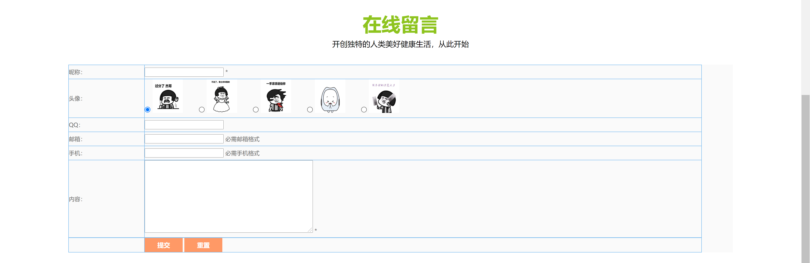
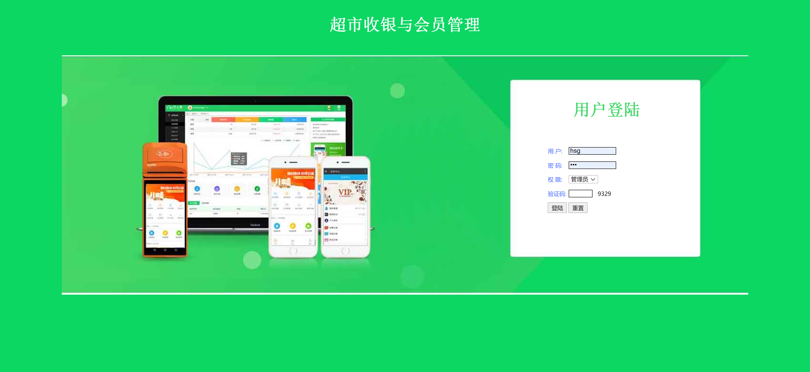
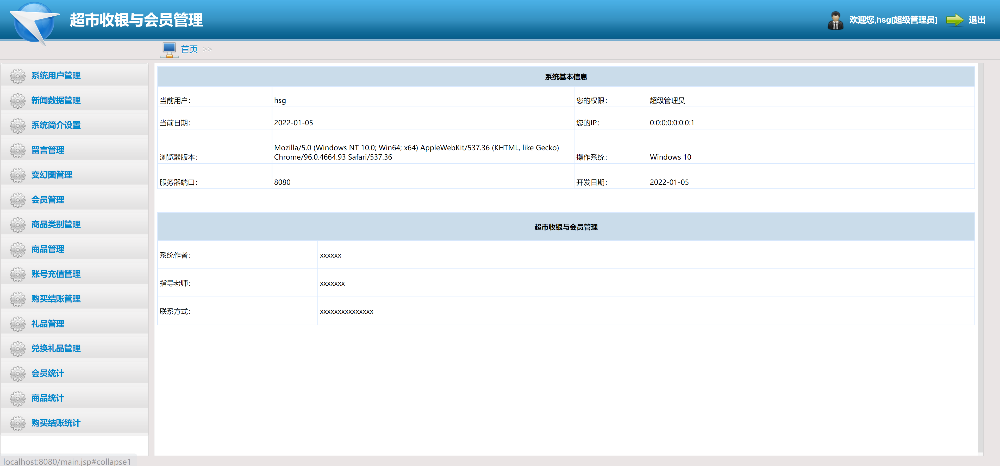
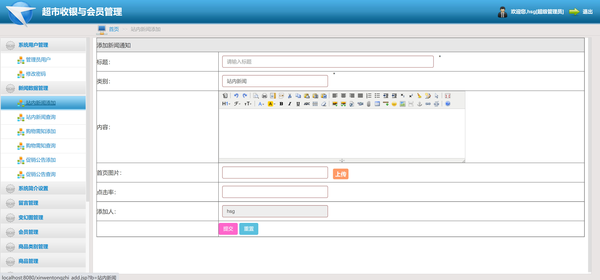
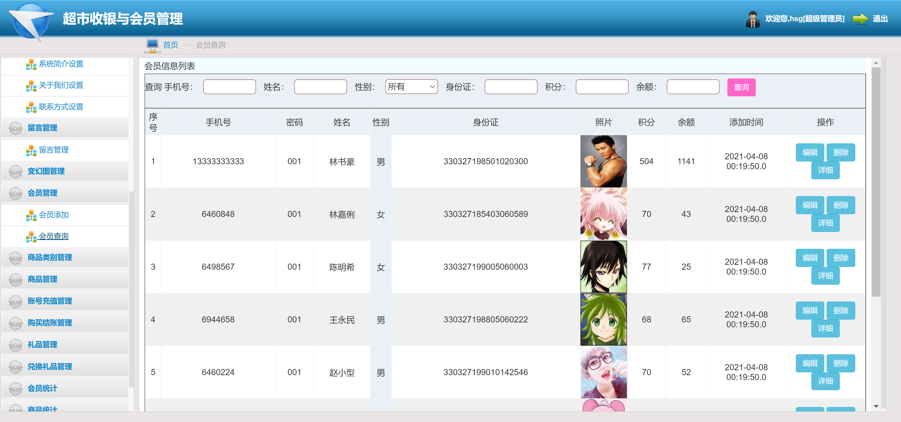
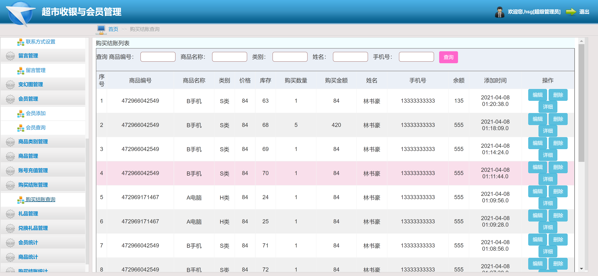
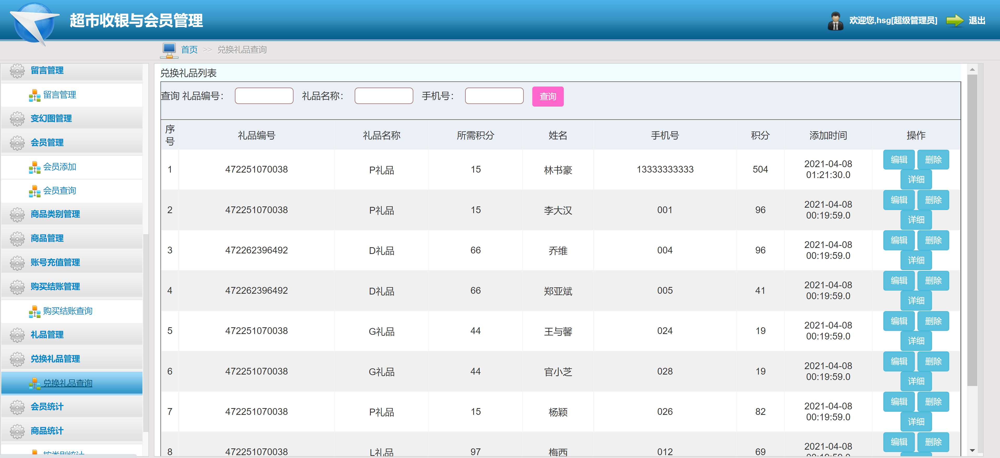

<h1 align="center">超市收银与会员管理系统</h1>

## 简介
超市收银与会员管理系统：角色分为管理员、用户；系统包含用户管理、商品管理、会员管理、礼品管理、结账统计、留言反馈等功能，提升收银效率与用户体验。    --计算机毕业设计源码；毕设源码；java毕业设计源码

## 联系方式

<h3 align="center">获取完整代码与数据库文件 + 微信：bysj5151 QQ: 86050149 QQ群: 783742310</h3>

<h3 align="center">可帮忙远程部署 包运行成功！提供远程部署、修改代码、设计文档指导、代码讲解等服务！</h3>

## 功能介绍（完整见运行截图）
管理员：基本功能包括登录、注册和退出。系统提供网站首页导航、商品管理、会员管理、留言管理、以及后台管理等功能。管理员可以查看和编辑商品信息、会员信息，并进行统计分析。界面设计简洁，支持快速查询和操作。

用户：用户可以通过注册和登录访问系统，浏览商品列表、查看商品详情、并将商品加入购物车进行结算。用户中心提供个人信息管理、订单查询、地址管理和收藏功能。系统界面友好，旨在提升用户购物体验。

## 运行截图

本代码来源于网络,仅供学习参考使用!

